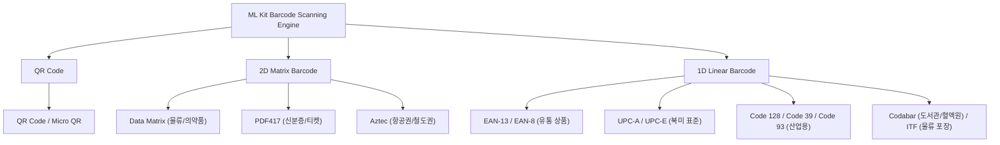

# Android Barcode & QR Reader 프로젝트 기술 가이드

이 저장소는 **Android 스마트폰 카메라를 활용한 오프라인 올인원 바코드/QR 코드 리더기**를 AI 바이브 코딩(Vibe Coding) 기법으로 구현한 2개의 독립 안드로이드 프로젝트를 포함하고 있습니다.

두 프로젝트 모두 네트워크 연결 없이 기기 내부 머신러닝 엔진(**Google ML Kit**)과 최신 카메라 스택(**Jetpack CameraX**)을 활용하여 **QR 코드**, **2D 매트릭스 코드**, **1D 선형 바코드**를 실시간으로 인식하고, 스캔 성공 시 경쾌한 비프음("삐")과 함께 데이터 형식 및 텍스트를 제공하며 클립보드 복사 기능을 지원합니다.

---

## 📂 프로젝트 개요 및 패키지 정보

| 프로젝트명 | 패키지명 (Application ID) | 개발 환경 / AI 모델 | 주요 아키텍처 특성 | 빌드 스택 |
| :--- | :--- | :--- | :--- | :--- |
| **`cursor_grok47`** | `kr.co.tkinfo.qrcursorgrok47` | Cursor + Grok 4.7 | • `LifecycleCameraController` + `MlKitAnalyzer` 간결 단일 구조<br>• 자동 변경 감지 및 연속 스캔(디바운스)<br>• 화면 이탈 후에도 마지막 결과 유지 | • Kotlin 2.0.21<br>• AGP 8.9.1 / Gradle 8.11.1<br>• compileSdk 36 / targetSdk 35 |
| **`gemini38flash`** | `kr.co.tkinfo.qrgemini38f` | Gemini 3.8 Flash | • `ProcessCameraProvider` + 모듈화된 분석기(`Analyzer`) 분리 구조<br>• 원샷 스캔 후 일시 정지 및 [다시 스캔] 버튼 재인식<br>• 상단 툴바, 플래시(Torch) 토글 및 햅틱 진동 피드백 탑재 | • Kotlin 1.9.22<br>• AGP 8.4 / Gradle 8.4<br>• compileSdk 34 / targetSdk 34 |

---

## 🎯 공통 요구사항 및 지원 바코드 규격

### 1. 공통 비즈니스 요구사항
- **온디바이스 오프라인 인식**: 인터넷 연결 권한(`INTERNET`) 없이 머신러닝 모델 번들링을 통한 완전 독립 구동
- **오디오 피드백**: 바코드 인식 성공 시 지연 없이 `ToneGenerator`를 통한 비프음("삐") 출력
- **텍스트 표시 및 복사**: 인식된 바코드의 규격 형식(Format) 및 페이로드 원문(Content) 표시, 클립보드 복사 기능
- **한글 및 다국어 인코딩**: UTF-8 기준 인코딩 처리로 한글 깨짐 방지
- **권한 관리**: Android 런타임 카메라 권한(`CAMERA`) 처리 및 거부 시 안내/설정 앱 연결

### 2. 지원 규격 매트릭스



---

## 🔬 프로젝트별 상세 비교 및 아키텍처 분석

### 1. 카메라 & ML 파이프라인 비교

#### (1) `cursor_grok47` (`kr.co.tkinfo.qrcursorgrok47`) : High-Level CameraController 접근법
- **핵심 클래스**: `androidx.camera.view.LifecycleCameraController` + `androidx.camera.mlkit.vision.MlKitAnalyzer`
- **구현 특징**:
  - CameraX의 고수준 추상화 계층인 `LifecycleCameraController`를 단일 Activity에 바인딩
  - `MlKitAnalyzer`를 직접 리스너로 등록하여 이미지 프레임 파이프라인의 보일러플레이트 코드를 최소화
  - `BarcodeScannerOptions`에 필요한 13개 포맷만 명시하여 전체 포맷 탐색으로 인한 프레임 드롭 방지
  - 이전 스캔 값(`lastValue`, `lastFormat`)과 비교하여 동일 바코드를 계속 비추고 있을 때 비프음과 UI 렌더링이 무한 반복되는 현상 방지
  ```kotlin
  // cursor_grok47 스캔 처리 핵심 로직
  val controller = LifecycleCameraController(this).apply {
      cameraSelector = CameraSelector.DEFAULT_BACK_CAMERA
      setEnabledUseCases(CameraController.IMAGE_ANALYSIS)
  }
  controller.setImageAnalysisAnalyzer(
      mainExecutor,
      MlKitAnalyzer(
          listOf(scanner),
          CameraController.COORDINATE_SYSTEM_VIEW_REFERENCED,
          mainExecutor
      ) { result ->
          handleScanResult(result.getValue(scanner))
      }
  )
  ```

#### (2) `gemini38flash` (`kr.co.tkinfo.qrgemini38f`) : Component-Driven Provider 접근법
- **핵심 클래스**: `androidx.camera.lifecycle.ProcessCameraProvider` + `BarcodeAnalyzer` (Custom `ImageAnalysis.Analyzer`)
- **구현 특징**:
  - `MainActivity`, `BarcodeAnalyzer`, `BarcodeFormatMapper`로 역할을 명확히 분리하여 모듈화
  - 전용 백그라운드 단일 스레드(`Executors.newSingleThreadExecutor()`)에서 프레임 이미지 디코딩 및 ML Kit 분석 수행
  - 바코드 인식 시 `isEnabled = false` 플래그를 통해 추가 분석을 중단(원샷 모드)하고, UI에서 사용자가 **[다시 스캔]** 버튼을 탭하면 재활성화
  - 인식된 바코드의 `rawBytes`를 직접 검사하여 UTF-8 문자열로 디코딩 보정
  - 상단 툴바(`QR-Reader`), 카메라 플래시(토치) On/Off 및 `Vibrator`를 통한 햅틱 진동 피드백 결합
  ```kotlin
  // gemini38flash 분석기 및 UTF-8 보정 로직
  val decodedText = primaryBarcode.rawBytes?.let { bytes ->
      try {
          String(bytes, StandardCharsets.UTF_8)
      } catch (e: Exception) {
          primaryBarcode.rawValue ?: ""
      }
  } ?: (primaryBarcode.rawValue ?: primaryBarcode.displayValue ?: "")
  ```

---

### 2. 기술 스택 및 의존성 비교표

| 분류 | `cursor_grok47` | `gemini38flash` | 기술적 차이 및 시사점 |
| :--- | :--- | :--- | :--- |
| **패키지 식별자 (PKG)** | `kr.co.tkinfo.qrcursorgrok47` | `kr.co.tkinfo.qrgemini38f` | 독립 패키지로 동일 기기 동시 설치 가능 |
| **Kotlin 버전** | `2.0.21` | `1.9.22` | K2 컴파일러 도입 여부 |
| **Android Gradle Plugin** | `8.9.1` | `8.4.0` | 최신 빌드 툴체인 요구조건 차이 |
| **Gradle 버전** | `8.11.1` | `8.4` | Gradle Wrapper 배포본 기준 |
| **Compile / Target SDK** | `compileSdk 36` / `targetSdk 35` | `compileSdk 34` / `targetSdk 34` | Android 15/16 타깃 vs Android 14 기준 |
| **Min SDK** | API 24 (Android 7.0) | API 24 (Android 7.0) | 광범위한 실기기 호환성 확보 |
| **CameraX 버전** | `1.6.2` (최신 라인) | `1.4.1` (16KB Page 대응 라인) | 고수준 컨트롤러 API 지원 버전 차이 |
| **ML Kit 버전** | `17.3.0` (On-Device 번들) | `17.3.0` (On-Device 번들) | 오프라인 모델 및 인식 정확도 동일 |
| **의존성 관리 방식** | Version Catalog (`libs.versions.toml`) | 직접 하드코딩 (`build.gradle.kts`) | 모던 빌드 스펙 유지보수성 |
| **사용자 피드백** | 사운드 (`ToneGenerator`) | 사운드 (`ToneGenerator`) + 진동 (`Vibrator`) | 촉각 피드백 추가 유무 |
| **카메라 부가 제어** | 기본 후면 자동 노출/초점 | 후면 카메라 + 플래시(Torch) 토글 | 손전등 기능 지원 여부 |

---

## 📁 디렉토리 구조 가이드

```text
android_qr_vibe/
├── cursor_grok47/                    # [프로젝트 1] PKG: kr.co.tkinfo.qrcursorgrok47
│   ├── app/
│   │   ├── build.gradle.kts          # compileSdk 36, CameraX 1.6.2 의존성
│   │   └── src/main/
│   │       ├── AndroidManifest.xml   # 카메라 권한 및 세로 모드 고정
│   │       ├── java/kr/co/tkinfo/qrcursorgrok47/
│   │       │   └── MainActivity.kt   # 카메라, 스캔, 오디오, 렌더링 통합 액티비티
│   │       └── res/layout/activity_main.xml
│   ├── gradle/libs.versions.toml     # TOML 의존성 카탈로그
│   ├── prompt.md                     # 초기 요구사항 및 프롬프트
│   └── README.md                     # 개별 기술 문서
│
├── gemini38flash/                    # [프로젝트 2] PKG: kr.co.tkinfo.qrgemini38f
│   ├── app/
│   │   ├── build.gradle.kts          # compileSdk 34, CameraX 1.4.1 의존성
│   │   └── src/main/
│   │       ├── AndroidManifest.xml   # 카메라 권한 및 액티비티 설정
│   │       ├── java/kr/co/tkinfo/qrgemini38f/
│   │       │   ├── MainActivity.kt   # 메인 컨트롤러 및 상단 툴바/플래시 제어
│   │       │   ├── BarcodeAnalyzer.kt      # 프레임 분석 & UTF-8 인코딩 처리
│   │       │   └── BarcodeFormatMapper.kt  # 한글 명칭 및 카테고리 매퍼
│   │       └── res/layout/activity_main.xml
│   ├── prompt.md                     # 초기 요구사항 및 프롬프트
│   └── README.md                     # 개별 기술 문서
│
└── README.md                         # 본 종합 기술 가이드 문서
```

---

## 🛠 빌드 및 실행 가이드

### 1. 개발 환경 요구 사항
- **Android Studio**: Android Studio Koala / Ladybug (2024.1+) 이상 권장
- **JDK (Java Development Kit)**: **JDK 17** 또는 **JDK 21** 권장
  > [!WARNING]
  > **JDK 25 주의사항**: JDK 25 환경에서는 Gradle 실행 시 호환성 에러가 발생할 수 있습니다. Android Studio의 `Settings > Build, Execution, Deployment > Build Tools > Gradle > Gradle JDK` 설정을 JDK 17 또는 21로 지정하십시오.
- **Android SDK**:
  - `cursor_grok47`: SDK Platform 36 및 Build-Tools 36.0.0 설치 필요
  - `gemini38flash`: SDK Platform 34 및 Build-Tools 34.0.0 설치 필요

### 2. 프로젝트 열기 및 실행 절차
1. Android Studio 실행 후 `Open`을 클릭합니다.
2. 원하는 프로젝트의 폴더(`cursor_grok47` 또는 `gemini38flash`)를 선택하여 엽니다.
3. Gradle Sync가 완료되면, 실물 안드로이드 스마트폰을 USB 디버깅으로 연결합니다.
4. 상단의 `Run 'app'` (단축키: `Shift + F10`)을 실행합니다.

### 3. CLI를 통한 APK 빌드 (터미널)

#### `cursor_grok47` (`kr.co.tkinfo.qrcursorgrok47`) 디버그 APK 빌드:
```bash
cd cursor_grok47
./gradlew assembleDebug
# 출력 경로: app/build/outputs/apk/debug/app-debug.apk
```

#### `gemini38flash` (`kr.co.tkinfo.qrgemini38f`) 디버그 APK 빌드:
```bash
cd gemini38flash
./gradlew assembleDebug
# 출력 경로: app/build/outputs/apk/debug/app-debug.apk
```

---

## 💡 개발자 트러블슈팅 & 핵심 팁

> [!TIP]
> **1. 고밀도 바코드(PDF417, Data Matrix) 인식률 향상**
> - PDF417이나 매우 작은 크기의 2D 바코드는 충분한 픽셀 해상도가 필요합니다. 카메라 가이드 프레임 내에 코드가 크게 차도록 거리를 15~25cm 수준으로 조절하거나 조명을 활용하여 반사를 줄이세요.
>
> **2. ML Kit 모델과 APK 크기**
> - 완전 오프라인 구동을 위해 번들형(`com.google.mlkit:barcode-scanning`) 모델을 채택하였습니다.
> - 만약 APK 크기를 극단적으로 줄여야 하는 환경이라면 Google Play 서비스 기반 언번들 모델(`play-services-code-scanner` 또는 unbundled ML Kit)로 마이그레이션할 수 있습니다(단, Google Play 서비스가 없는 기기나 오프라인 초기 실행 시 모델 다운로드 필요).
>
> **3. 비프음 지연 없는 재생 (Low Latency Audio)**
> - `MediaPlayer`나 `SoundPool`은 파일 I/O 및 로딩 지연이 발생할 수 있습니다. 두 프로젝트 모두 `android.media.ToneGenerator(AudioManager.STREAM_MUSIC, 100)`를 채택하여 별도의 리소스 파일 없이 하드웨어 레벨에서 즉각적인 150~180ms 비프음을 출력하도록 구현되었습니다.
