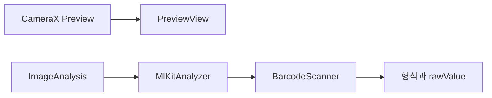

# QR 리더 개발자 가이드

휴대폰 후면 카메라로 QR 코드, 2D 바코드, 1D 바코드를 읽고 형식 이름과 원문 텍스트만 보여주는 Android 앱이다. 네트워크 없이 기기 안에서 인식한다.

## 요구사항 대응

| 요구사항 | 구현 |
| --- | --- |
| QR 바코드 리딩 | `Barcode.FORMAT_QR_CODE` |
| 2D 바코드 리딩 | Data Matrix, PDF417, Aztec |
| 1D 바코드 리딩 | Code 128, Code 39, Code 93, Codabar, EAN-13, EAN-8, ITF, UPC-A, UPC-E |
| 리딩 후 텍스트 표시 | 하단 카드에 형식과 `Barcode.rawValue`를 표시. 복사 버튼과 성공 비프음 |
| Kotlin, Android 휴대폰, Android Studio 프로젝트 | Kotlin 단일 모듈 앱. 이 폴더가 Studio 프로젝트 루트 |
| 한글 UTF-8 | 소스, 리소스, 이 문서는 UTF-8. 인식 문자열은 변환 없이 표시 |

URL 열기, 스캔 이력, 핀치 줌은 넣지 않았다.

## 기술 스택

| 항목 | 버전 | 이유 |
| --- | --- | --- |
| 언어 | Kotlin 2.0.21 | Android Studio 기본 언어 |
| Android Gradle Plugin | 8.9.1 | CameraX 1.6.2가 AGP 8.9.1 이상을 요구한다 |
| Gradle | 8.11.1 | AGP 8.9.1의 최소 Gradle |
| compileSdk / build-tools | 36 / 36.0.0 | CameraX 1.6.2가 API 36 이상으로 컴파일해야 한다 |
| targetSdk | 35 | 런타임 동작은 API 35 기준. compileSdk와 분리할 수 있다 |
| minSdk | 24 | Android 7.0 이상 휴대폰 |
| JDK | 17 또는 21 | Gradle 8.11.1을 실행하는 JVM. JDK 25에서는 기동하지 않는다 |
| CameraX | 1.6.2 | `LifecycleCameraController`와 `MlKitAnalyzer` |
| ML Kit Barcode Scanning | 17.3.0 번들 모델 | 오프라인 인식. `rawValue`가 유니코드 문자열 |

CameraX 1.6.2는 AGP 8.7.3과 compileSdk 35 조합으로는 빌드되지 않는다. AAR 메타데이터가 AGP 8.9.1과 compileSdk 36을 최소 조건으로 걸기 때문이다. 플러그인 DSL은 기존 `plugins` / `android` 블록을 그대로 쓴다.

ML Kit의 Play 서비스(언번들) 버전 대신 `com.google.mlkit:barcode-scanning`을 쓴다. 인식 모델이 APK에 들어가서 설치 후 인터넷이 없어도 동작한다. 그래서 `INTERNET` 권한은 없다. APK 용량은 모델 때문에 커진다.

`FORMAT_ALL_FORMATS`는 쓰지 않는다. Google 문서에서 필요한 형식만 지정하라고 하며, 전체를 켜면 인식이 느려진다. 요구사항에 있는 형식만 `BarcodeScannerOptions`에 나열했다.

## 지원 형식

QR

- QR Code

2D

- Data Matrix
- PDF417
- Aztec

1D

- Code 128, Code 39, Code 93, Codabar
- EAN-13, EAN-8
- ITF
- UPC-A, UPC-E

화면의 형식 이름은 규격 이름 그대로다. 예: `QR Code`, `EAN-13`.

## 프로젝트 구조

```
qr_reader/
  settings.gradle.kts
  build.gradle.kts
  gradle.properties
  gradle/libs.versions.toml
  gradle/wrapper/
  app/build.gradle.kts
  app/src/main/AndroidManifest.xml
  app/src/main/java/kr/co/tkinfo/qr26/MainActivity.kt
  app/src/main/res/layout/activity_main.xml
  app/src/main/res/values/strings.xml
  app/src/main/res/values/themes.xml
  app/src/main/res/values/colors.xml
  prompt.md          원래 요구사항. 앱 빌드에는 쓰이지 않는다
```

패키지와 applicationId는 `kr.co.tkinfo.qr26`이다. 화면은 `MainActivity` 하나이고, 레이아웃은 ViewBinding(`ActivityMainBinding`)으로 연결한다.

## 동작 흐름



1. `onStart`에서 `CAMERA` 권한이 있으면 `startCamera()`를 호출한다.
2. `LifecycleCameraController`가 후면 카메라 미리보기를 `PreviewView`에 붙인다.
3. 사용 케이스는 `IMAGE_ANALYSIS`만 켠다. 사진 저장은 하지 않는다.
4. `MlKitAnalyzer`가 프레임을 `BarcodeScanner`에 넘긴다. 콜백 실행기는 메인 스레드다.
5. 결과 목록에서 `rawValue`가 있는 첫 바코드를 고른다.
6. 직전과 형식, 문자열이 같으면 화면을 다시 그리지 않고 비프음도 내지 않는다. 같은 코드를 계속 비춰도 깜빡이지 않게 하기 위함이다.
7. 새 값이 인식되면 화면을 갱신하고 `ToneGenerator`로 약 180ms짜리 "삐" 소리를 낸다. 미디어 볼륨을 따른다.
8. 바코드가 프레임에서 빠져도 마지막 결과는 남겨 둔다.
9. 복사는 `lastValue`만 클립보드에 넣는다. 안내 문구는 복사되지 않는다.

중앙 사각형은 사용자가 위치를 맞추는 안내선이다. 인식 영역은 미리보기 전체다.

## 화면과 권한

매니페스트에는 `android.permission.CAMERA`와 `android.hardware.camera`(필수)만 있다. 액티비티는 세로 고정이다.

권한 흐름:

- 첫 실행에서 시스템 권한 창을 띄운다.
- 허용하면 미리보기를 시작한다.
- 거부하면 한글 안내와 `다시 요청`을 보여 준다.
- 다시 묻지 않음이면 `다시 요청`을 숨기고 `설정 열기`로 앱 설정 화면을 연다.
- 설정에서 허용한 뒤 돌아오면 `onStart`가 카메라를 시작한다.

인식 전에는 내용에 `바코드를 화면에 비추세요`가 보이고 복사 버튼은 비활성이다.

## 빌드와 실행

1. Android Studio에서 이 폴더(`settings.gradle.kts`가 있는 곳)를 연다.
2. Studio가 `local.properties`의 `sdk.dir`를 만든다. 이 파일은 git에 넣지 않는다.
3. SDK Platform 36과 Build-Tools 36.0.0이 필요하다. SDK Manager에서 설치한다.
4. Gradle JDK를 17 또는 21로 지정한다.  
   `Settings` - `Build, Execution, Deployment` - `Build Tools` - `Gradle` - `Gradle JDK`  
   이 개발 환경의 Android Studio JBR은 JDK 25다. Gradle 8.11.1은 JDK 25에서 `25.0.3`만 출력하고 실패한다. JDK 21 예시 경로는 `C:\Program Files\Android\openjdk\jdk-21.0.8`이다.
5. Sync 후 Run 한다. 첫 동기화는 Gradle 배포본과 Maven 의존성을 받는다.

디버그 APK는 `app/build/outputs/apk/debug/app-debug.apk`다.

명령줄 예:

```bat
set JAVA_HOME=C:\Program Files\Android\openjdk\jdk-21.0.8
gradlew.bat assembleDebug
```

에뮬레이터 웹캠으로도 미리보기는 뜨지만, 바코드 인식은 실기기에서 확인하는 편이 맞다. 카메라는 후면만 사용한다.

## 한글과 UTF-8

- Kotlin, XML, `README.md`, `gradle.properties`의 `-Dfile.encoding=UTF-8`은 UTF-8이다.
- Android 리소스 XML은 UTF-8이 기본이라 `strings.xml`의 한글이 그대로 표시된다.
- ML Kit은 QR에 들어 있는 UTF-8(ECI) 페이로드를 `Barcode.rawValue` 문자열로 디코드한다. 앱은 그 문자열을 다시 인코딩하지 않고 `TextView`에 넣는다.
- 바코드 자체가 EUC-KR 같은 다른 인코딩으로 만들어졌으면 ML Kit이 유니코드로 풀지 못할 수 있다. 그 경우는 바코드 생성 쪽을 UTF-8로 맞춘다.

## 주요 코드

`MainActivity`가 권한, 카메라, 결과 표시를 모두 담당한다.

- `createBarcodeScanner()` : 형식 목록으로 스캐너를 한 번만 만든다. 액티비티가 끝날 때 `close()`한다.
- `startCamera()` : 컨트롤러를 라이프사이클에 묶고 분석기를 등록한다. 초기화 실패 시 `카메라를 사용할 수 없습니다.`를 띄운다.
- `handleScanResult()` : 오류는 한 번만 토스트한다. 빈 프레임은 무시한다. 새 인식에만 `playBeep()`를 호출한다.
- `formatName()` : ML Kit 형식 상수를 화면 문자열로 바꾼다.

레이아웃 `activity_main.xml`은 미리보기, 안내 프레임, 결과 카드, 권한 패널로 구성된다. 미리보기는 `keepScreenOn`이라 스캔 중 화면이 꺼지지 않는다.

## 실기기에서 볼 것

- 한글이 들어 있는 QR의 내용이 깨지지 않는지
- URL QR, EAN-13, Code 128이 형식 이름과 함께 보이는지
- 가능하면 Data Matrix, PDF417, Aztec
- 새 코드가 읽히면 "삐" 소리가 한 번 나는지. 같은 코드를 유지하면 소리가 반복되지 않는지
- 같은 코드를 유지할 때 텍스트가 다시 깜빡이지 않는지
- 코드가 사라져도 마지막 내용이 남는지
- 복사가 인식된 문자열만 담는지
- 권한 거부, 다시 요청, 설정에서 허용 후 복귀

## 인식이 안 될 때

- 조명을 밝히고, 초점이 맞을 때까지 거리를 조절한다.
- PDF417처럼 촘촘한 코드는 프레임 안에 더 크게 들어오게 가까이 댄다. Google은 밀도가 높은 PDF417에 더 많은 픽셀이 필요하다고 안내한다.
- 손상되거나 반사되는 코드는 ML Kit이 거절할 수 있다.
- 분석 오류 토스트가 한 번 뜨면 앱을 다시 실행해 스캐너를 다시 만든다.
- Gradle이 버전 번호만 찍고 끝나면 Gradle JDK가 25 이상이다. JDK 21로 바꾼다.
